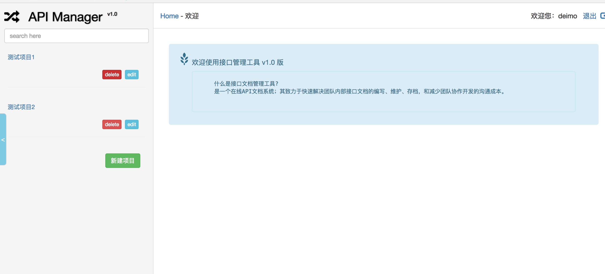

## 项目介绍

一个使用django生成的简单的API管理工具，可以方便编写API文档，感谢原作者提供的代码，原作者项目所在[地址](https://github.com/tangguoying2018/api_manager)

和原作者相比增加了以下特性
1. 支持python3+
2. django2.0+
3. 可以在windows上开发并预览（使用了pymysql数据库驱动连接）
4. 修复了textarea无法随文字高度变化的bug
5. 简化参数处理，自定义中间件，自定义异常
6. 修改了部分模型


## 要求
1. python3 required
2. django 2.0+ required
3. mysql required
4. pymysql required
5. uwsgi required
6. supervisor required

## 使用方法
1. 创建虚拟环境
    ```
    python3 -m venv env
    ```

2. 安装依赖
    ```
    env/bin/pip install -r requirements.txt
    ```

3. 修改配置文件

    本地调试修改dev_settings.py即可
    正式上线请修改prod_settings

4. 同步数据库
    ```
    python manage.py makemigrations
    python manage.py migrate
    ```
5. 收集静态文件
    ```
    python manage collectstatic
    ```
6. 创建用户
    ```
    python manage.py createsuperuser
    ```

7. 开始本地测试
    ```
    python manage runserver
    ```

## 部署方法

1. 执行deploy.template文件夹中的shell脚本
   ```
   sh genconf.sh
   ```
2. 配置uwsgi
    根据项目需要修改uwsgi配置参数，示例文件可参考**template.uwsgi.ini**

3. 配置nginx
    参考实例文件**template.nginx.conf**

4. 使用supervisor管理uwsgi进程
    supervisor的配置文件参考**template.supervisor.conf**

5. 建立log目录，根据需要touch出相应的日志文件

## 应用截图





## LICENSE

   项目遵循LGPL-3.0开源协议，具体详情请参阅相关许可文件的详细信息

